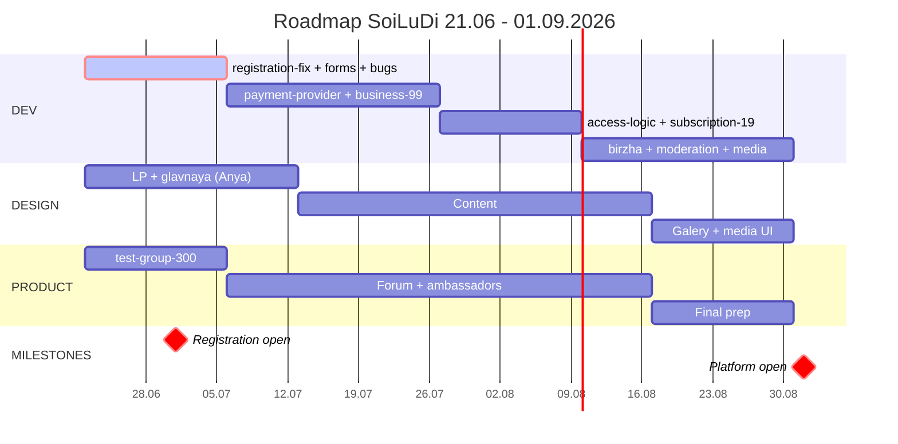

# Roadmap SoiLüDi → 01.09.2026

**Создано:** 2026-06-21 (W26)
**Темп:** 1 спринт/неделю
**Треки:** 3 параллельных (Dev / Дизайн / Продукт)

---

## 🎯 Ориентиры по срокам (не жёсткие дедлайны)

| Дата (ориентир) | Что |
|---|---|
| **~01.07.2026** | Регистрация пользователей открыта |
| **~01.09.2026** | Платформа открыта для всех |

> Это направляющие цели для планирования темпа, а не обязательства. Сдвигаем спокойно, если нужно.

---

## Гантт-диаграмма



---

## Разбивка по фазам

### 🔴 Фаза 1: запуск регистрации (W26–W27, 22.06 – 05.07)

**Цель:** к 01.07 юзер может зарегистрироваться и зайти на сайт.

| Трек | Что |
|---|---|
| Dev | `registration-fix` (текущий пилот) + `forms-mvp-backend` + `bugs-cleanup` |
| Дизайн | Аня дорабатывает главную и LP, координация с Антоном по карте |
| Продукт | Собрать тестовую группу 300 из чата, onboarding-инструкции |

**Блокеры:**
- Custom SMTP провайдер (нужно решить эту неделю)
- Решение «капча vs email-confirm» — уже принято (email-confirm)

---

### 🟣 Фаза 2: монетизация бизнесов (W28–W30, 06.07 – 26.07)

**Цель:** бизнесы могут платить 99 CHF и попадать в каталог.

| Трек | Что |
|---|---|
| Dev | `payment-provider` (выбор + интеграция) → `business-99` |
| Дизайн | Контент-статьи на сайт, образовательные материалы |
| Продукт | Площадка для офлайн-форума, начало работы со спикерами |

**Блокеры:**
- Выбор платёжного провайдера (нужно решить эту неделю)
- Pyrex нестабилен — замена обязательна

---

### 🟢 Фаза 3: gating и подписки (W31–W32, 27.07 – 09.08)

**Цель:** активирована логика free/premium, юзеры могут платить 19 CHF.

| Трек | Что |
|---|---|
| Dev | `access-logic` → `subscription-19` |
| Дизайн | Продолжение контента, гайды |
| Продукт | Форум + рекрутинг амбассадоров по кантонам |

**Блокеры:**
- Финальное решение «что видит anon vs free vs premium»

---

### 🟠 Фаза 4: полный функционал (W33–W35, 10.08 – 30.08)

**Цель:** биржа, модерация, медиа, рефералка — всё для запуска 01.09.

| Трек | Что |
|---|---|
| Dev | `birzha-auth` + `catalog-moderation` + `events-moderation` + `media-uploads` + `referral-program` + `user-content-moderation` |
| Дизайн | Галерея + media-upload UI |
| Продукт | Финальная подготовка к 01.09, событие-форум, маркетинг |

**Блокеры:**
- Процесс модерации (роли, SLA, правила) — нужно решить к W31
- Медиа-политика (типы, размеры, хранение) — к W33
- Бонусная экономика — к W33

---

## 📌 Про объём и темп

В колонке Dev — 4 фазы, внутри них 10+ функциональных задач. Это много, поэтому **темп держим комфортный, без гонки**: ориентиры по датам — направляющие, а не обязательства. Если фаза занимает больше времени — спокойно сдвигаем, дату подстраиваем под реальность.

Рычаги, если захотим ускориться или разгрузиться:
1. **Второй разработчик** — поднять темп (Ivanna работает по сайтам — можно обсудить загрузку)
2. **Вынести часть за ориентир** — кандидаты на «после запуска»: `referral-program`, `user-content-moderation`, расширенный бизнес-тариф (150)
3. **Урезать scope MVP** — запустить с базовым функционалом, доделывать позже

Решение по подходу — на следующей встрече с командой.

---

## 🚦 Critical path

Без этих пунктов 01.09 не случается:

```
registration-fix → payment-provider → business-99 → access-logic → subscription-19 → birzha-auth
```

Всё что не на critical path можно сдвигать, не двигая дату.

---

## ✅ Открытые продуктовые решения (по фазам)

| Решение | Нужно к | Кто решает |
|---|---|---|
| Custom SMTP провайдер | W26 (сейчас) | Ksenya + dev |
| Платёжный провайдер | W26-W27 | Ksenya + bookkeeper |
| Что видит anon vs free vs premium | W30 | Ksenya |
| Процесс модерации (роли, SLA) | W31 | Ksenya + амбассадоры |
| Медиа-политика | W33 | Ksenya + dev |
| Бонусная экономика | W33 | Ksenya |
| Бизнес-тариф расширенный (99 vs 150) | W30 | Ksenya |
| Юридика по кантонам | continuous | юр. консультант |

---

## История

- **2026-06-29** — даты переформулированы как ориентиры; убраны «жёсткие дедлайны», «ноль резерва»,
  «один срыв = сдвиг». Темп комфортный, даты подстраиваются под реальность.
- **2026-06-21** — создан после встречи 06-18, согласован с обновлённым BACKLOG
